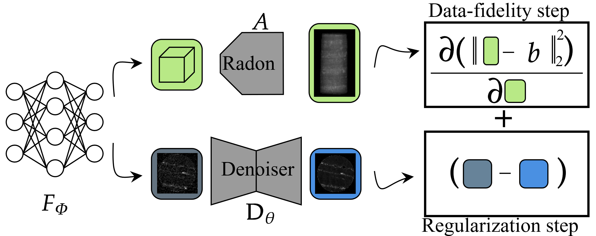

# Neural Field Regularization by Denoising for 3D Sparse-View X-Ray Computed Tomography

Code for the paper [Neural Field Regularization by Denoising for 3D Sparse-View X-Ray Computed Tomography](https://doi.ieeecomputersociety.org/10.1109/3DV62453.2024.00094) by [Romain Vo](https://romainvo.github.io/), Julie Escoda, Caroline Vienne and [Étienne Decencière](https://people.cmm.minesparis.psl.eu/users/decenciere/).

<p align="center">
    
</p>

## Pre-requisites

The code for the neural-field and grid-based reconstruction is written in `pytorch`. 

```
conda install pytorch==2.2.0 torchvision==0.17.0 torchaudio==2.2.0 pytorch-cuda=11.8 -c pytorch -c nvidia
```

### Neural Field

We use [Instant-NGP](https://nvlabs.github.io/instant-ngp/assets/mueller2022instant.pdf) as the neural field, you will have to install the following libraries to optimize a neural field, which might be a bit tricky to resolve. Pleae follow the instructions mentionned in in each repo for the installations:
- `nerfacc==0.5.3` : https://github.com/KAIR-BAIR/nerfacc
- `tiny-cuda-nn==1.7` : https://github.com/NVlabs/tiny-cuda-nn
- `pytorch-scatter` : https://github.com/rusty1s/pytorch_scatter


### Tomography

We switch from the paper original implementation that used `TIGRE` to `astra-kernelkit==0.1.0` (https://github.com/adriaangraas/astra-kernelkit) for better interoperability with `pytorch`. This allows to fully write the code in `pytorch` and do the optimization on a single GPU. We also use nesterov acceleration to reduce the number of iterations.


For the rest, you will need the following libraries:
- `cupy`
- `numpy`
- `pandas`
- `matplotlib`
- `tifffile`
- `pyyaml`
- `tqdm`
- `timm`
- `pillow`
- `piqa`
- `commentjson`
- `tqdm`

The libraries are compiled using cuda 11.8.

## Citation

```bibtex
@inproceedings{voNeuralFieldRegularization2024,
  title={Neural Field Regularization by Denoising for 3D Sparse-View X-Ray Computed Tomography},
  author={Vo, Romain and Escoda, Julie and Vienne, Caroline and Decenci{\`e}re, {\'E}tienne},
  booktitle = {2024 International Conference on 3D Vision (3DV)},
  year={2024},
  month = mar,
  doi = {10.1109/3DV62453.2024.00094},
}
```